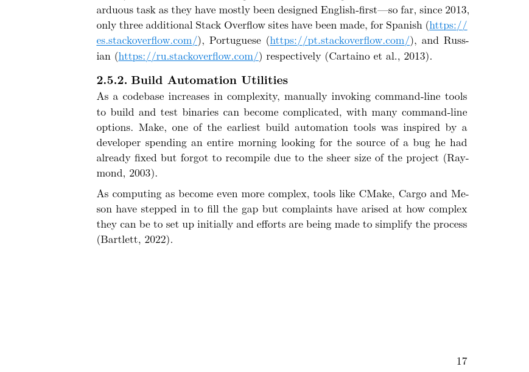
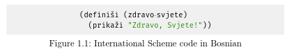
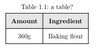

# bach-typst-temp

> [!CAUTION]
> this ~~is undergoing massive revamping due to last minute changes and~~ will no longer be updated here.
> 
> check the [codeberg repo](https://codeberg.org/fumnanya/bachelors-typst) instead.

a [typst](https://typst.app) template for my [final year project](https://github.com/poopsicles/bachelors) here at [covenant university](https://en.wikipedia.org/wiki/Covenant_University).

very opinonated, crossed-out ~~items~~ mean i didn't like what they said we should do in the [word doc](word_template.docx) (items marked with * can be reverted with print mode).

- [font](bach.typ#L65)*: ~~Times New Roman~~ New Computer Modern 
    - [14pt](bach.typ#L112) - heading 1
    - [13pt](bach.typ#L113) - other headings
    - [12pt](bach.typ#L114) - body text
- [justify](bach.typ#L62): full
- [margins](bach.typ#L61): 
    - top, bottom, right - 1in
    - left: 1.5in
- [line spacing](bach.typ#L62): 1.5 line spacing in Word, [translates to 175% leading](https://practicaltypography.com/line-spacing.html) - 0.75em (not even sure about this tbh, word is hell)
- headings*: centred, ~~all caps~~ small caps
- [page numbers](bach.typ#L187)*: ~~centred~~ right-aligned
- [footer](bach.typ#L81)*: ~~30% line~~ dots
- table of contents: headings 1 ~~all caps~~ sentence case

apart from the template, this also provides:

- `blankify()` which shows either passed-in content or a "this page left blank" message.
- `code-figure(caption, code)` shows the passed-in code as an image figure.
- `table-figure(caption, table)` shows the passed-in table as a table figure (without justification).

## how to use:

- template:

  1. get [typst](https://typst.app) and [fira code nerd font](https://github.com/ryanoasis/nerd-fonts/releases/download/v3.1.1/FiraCode.zip).

  2. get the files:     
     ```sh
     $ git submodule add https://github.com/poopsicles/bach-typst-temp template
     ```

  3. make sure your folder looks like this (`project.typ` is your main typst file, `references.yml` is your [bibliography](https://typst.app//docs/reference/model/bibliography)):
     ```text
     .
     ├── project.typ
     ├── references.yml
     └── template
         ├── bach.typ
         ├── covenant.png
         ├── LICENSE
         └── README.md
     ```

  4. in `project.typ`, import the function and use it:

     ```text
     #import "template/bach.typ": bach
     
     #show: content => bach(
       title: "On instant noodles.",
       author: "Fumnanya",
       matric: "30XX123456",
       supervisor: "Dr. Supervisor",
       reference-path: "../references.yml",
       content,
     )

     = Introduction

     We begin, as all things should, with a word salad.

     #lorem(100)

     // put in the rest of your content
     ```  
  
  5. In the function call, the following fields can be added (if they're not, then a blank space/page will be shown instead, except for `print` which reverts some opinionated settings):

     ```text
     bach(
       title: "On instant noodles",
       author: "Fumnanya",
       matric: "30XX123456",
       supervisor: "Dr. Supervisor",
       date: datetime(year: 2024, month: 4, day: 1),
       abstract: [
         We attempt to make the perfect bowl of noodles.
       ],
       dedication: [
         To all who have fallen during the climb.
       ],
       acknowledgements: [
         No one else had a hand in this.
       ],
       print: true,
       content,
     )
     ```

     A rendering of this can be found [here](examples/example.pdf).

> [!IMPORTANT]  
> Make sure you set `print` to true ONLY when you're about to export a print-ready PDF (that will use their template settings including Times, centred page numbers, the default footer, and bare links).
>
> From the [Style and Grammar Guidelines](https://apastyle.apa.org/style-grammar-guidelines/references/dois-urls):
>
> *It is acceptable to use either the default display settings for hyperlinks in your word-processing program (e.g., usually blue font, underlined) or plain text that is not underlined.*
>
> *Leave links live if the work is to be published or read online.*
>
> |_pretty_|_print_|
> |:-:|:-:|
> |||

- `blankify()`:

  give it a thing and it'll return the thing:

  ```text
  #blankify([hi])

  // hi
  ```

  give it nothing and it'll show the page blank message:

    ```text
  #blankify(none)

  // this page left blank
  ```

- `code-figure(caption, code)`:

  just use it like a regular figure:
  
  ````text
  #code-figure(
    "International Scheme code in Bosnian", 
    ```scm
    (definiši (zdravo-svjete)
      (prikaži "Zdravo, Svjete!"))
    ```
  )
  ````

  

- `table-figure(caption, table)`:

  just use it like a regular figure:
  
  ````text
  #table-figure(
    "a table?", 
    table(
      columns: 2,
      table.header[Amount][Ingredient],
      [360g], [Baking flour],
    )
  )
  ````

  

